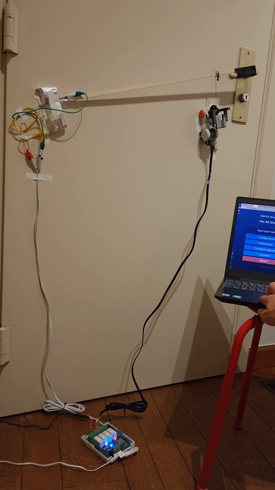
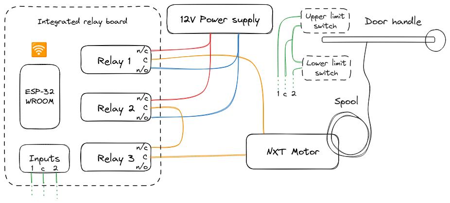
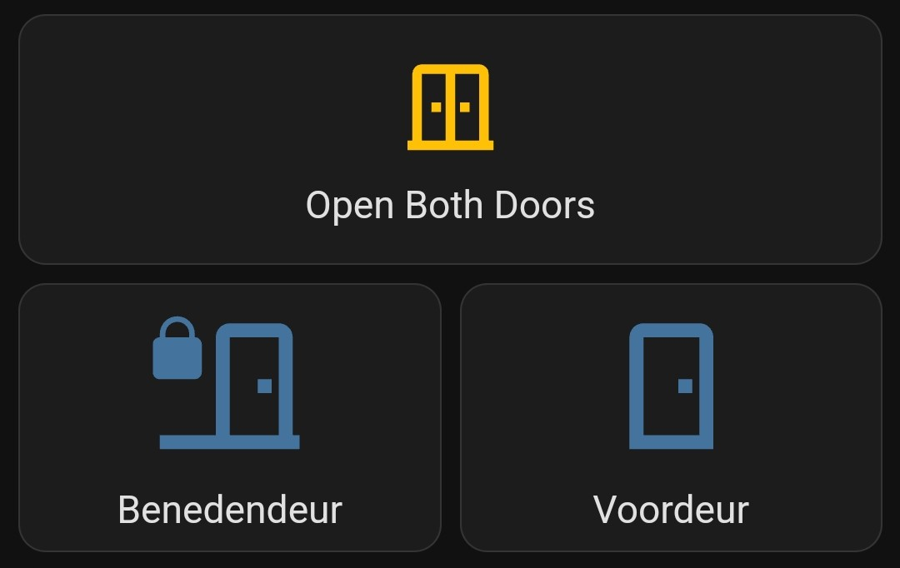
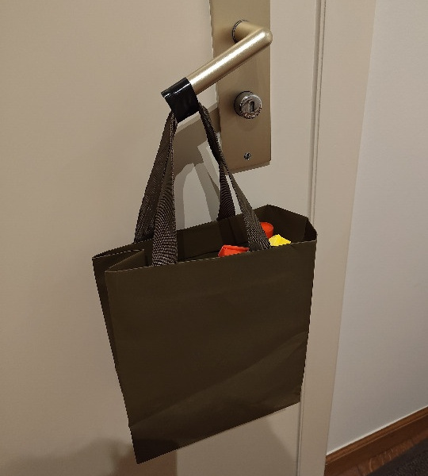
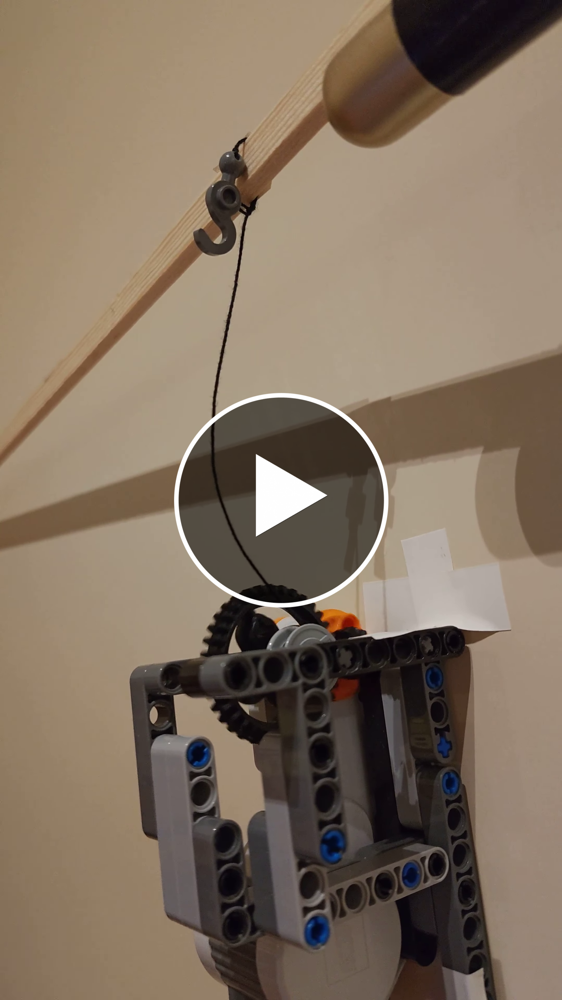

# Door Handle Opener 🚪🦾

**Non-intrusive IoT actuated door handle opener.**

Because an in-door smart lock was out of the question in our rented apartment,
and of course for the fun of it, I built this door handle opener. It straps to
the door handle and can easily be removed without leaving a trace (just like the
[space heater I
smartified](https://pfiers.net/projects/iot#smartifying-an-old-space-heater)).

## Hardware

The actuator that pulls on the door handle is a brushed [Lego Mindstorms NXT
motor](https://www.philohome.com/nxtmotor/nxtmotor.htm). This motor is powered by a generic 12V power supply I had lying
around. And it is switched by an H-bridge-y circuit with three relays. Two of the relays switch the motor direction, and
the third one cuts the motor power completely (see *[Motor Braking](#motor-braking)* below).

The generic 12V power supply and modified power connector for the relay terminals: 

The modified RJ12-terminated telephone cable I used to connect the NXT motor to the relay board: 

## Proof Of Concept

This [video](media/poc-demo.webm) shows the first proof of concept I built. I used the [Tasmota](https://tasmota.github.io/) web UI over WiFi
to activate the control script. The mess of aluminum foil on the left acts as the top and bottom limit switches (see
*[Diagram](#diagram)* below).

## Diagram

This diagram shows the motor and relay board, as well as the two limit switches
that detect the end positions of the door handle:

## Software

Taking a brake from implementing my own embedded IoT software in C++ or Rust, I decided to try the
[Berry](https://tasmota.github.io/docs/Berry/) scripting built into the popular [Tasmota](https://tasmota.github.io/)
IoT firmware. Berry is a simple dynamically typed embedded language with some hints of Lua and JavaScript. The entire
control code is contained in [door_handle_opener.be](door_handle_opener.be).

On demand, this script uses a small state machine to, first spool the string in to pull the door handle down, brake for
a bit, and finally unspool the string again to release the handle again.

A big advantage of using Tasmota is that it comes with easy [Home Assistant](https://www.home-assistant.io/)
integration. In the dashboard that looks like this: 

FYI: I trigger the common apartment buzzer ('Benedendeur') with a [Shelly Uni](https://www.shelly.com/en-be/products/shop/shelly-uni).

## Calculating Required Torque

Before looking for the right motor, I calculated the torque it would need to
apply to the door handle. For this I first determined the weight required to
overcome the static friction of the handle and daytime latch (at $9 cm$).

Measuring the force required to open the door handle:

This little experiment showed that I'd need a weight of at least $1.7 kg$, or a
force of $1.7 kg \cdot 9.8 m/s^2 = 16.7 N$. Converting this to torque around the
handle axis yields $16.7 N \cdot 0.09 m = 1.5 N \cdot m$. Because I needed to 3D print some
parts anyway, I also incorporated a $9/22 cm$ force multiplier for a longer
handle. In the end, this means the motor needs to apply a torque of at least
$0.6 N \cdot m$ at $22 cm$.

Looking though my parts bin, I didn't find any loose motors that could provide
this kind of torque. At least not without gearing. Instead, I went with a Lego
Mindstorms NXT motor, which makes gearing with Lego Technic parts easy.

From Philo's amazingly detailed *[ NXT® motor
internals](https://www.philohome.com/nxtmotor/nxtmotor.htm)* page, I learned
that the motor can handle a maximum of just over $0.2 N\cdot cm$. Using a large
[36 teeth](https://www.bricklink.com/v2/catalog/catalogitem.page?P=32498) and
small [12 teeth](https://www.bricklink.com/v2/catalog/catalogitem.page?P=32270)
gear I brought that up to exactly $0.2 N\cdot cm \cdot (36/12) = 0.6 N \cdot m$.
In the demo video above, you can see I went a little overboard with the level
arm to be absolutely sure the motor could handle the torque. After making sure
that worked, I moved the motor closer to the door handle, and found that the $22
cm$ prediction was spot on.

## Motor Braking

If you exclusively want to switch the direction of a brushed DC motor, you really only need two relays. By switching the
relays so that both leads of the motor are connected to the same polarity, the motor will brake (resisting approximately
its own maximum torque). While this setup is fine, I didn't like the idea of the motor potentially damaging itself or
the power supply when being turned. To add a fourth 'free spinning' mode besides, 'clockwise', 'counter-clockwise', and 'braking',
I connected a third relay to one of the motor leads. 

[Video](media/free-spin.webm) demonstrating free spin after hitting the top limit switch:

## 3D Print

Soon...  
<small>(maybe)</small>
